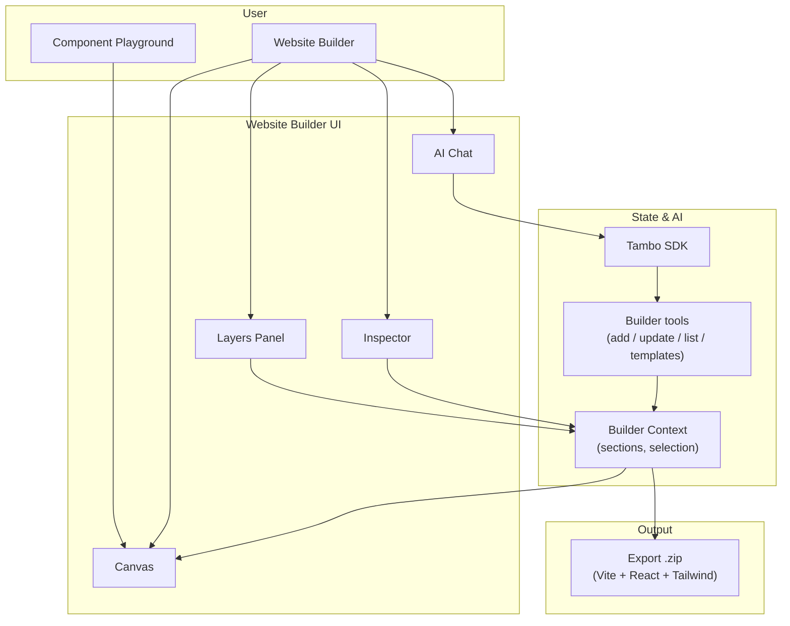

# Flex

Flex is a Vite + React design system playground and page-builder that lets you assemble website sections, edit them with live props or via AI chat, and export a starter React project as a `.zip`. Built with **React + TypeScript + Tailwind CSS**.

**Highlights**

- Interactive playground for components (preview + prop controls + code view)
- Website builder with layers, canvas, and inspector; export to a runnable Vite + React + Tailwind project
- Tambo-powered AI: add or edit sections from natural language in the builder

**Status:** Early-stage / experimental; APIs and website-builder flow may change. See [IMPLEMENTATION_STATUS.md](./IMPLEMENTATION_STATUS.md) for current work and planned features.

## Architecture



**Flow in short:** The builder’s **canvas** and **inspector** read from **Builder Context** (sections, selection). **AI Chat** sends messages to **Tambo**; Tambo calls **builder tools** (e.g. add section, update props, use templates), which dispatch into Builder Context. **Export** uses the same section state to generate the project zip.

## What you can do

- **Component playground** (`/`)
  - Preview components and tweak props in the right-side **Customize** panel.
  - View the generated code in the **Code** tab.
- **Website Builder** (`/tools/website-builder`)
  - Add sections/components from the left panel, edit their props in **Inspector**, and export a starter project as a `.zip`.
  - Export generates a minimal Vite + React + Tailwind starter project using the sections you assemble.

## Currently implemented components

See [IMPLEMENTATION_STATUS.md](./IMPLEMENTATION_STATUS.md) for the authoritative list of components that are wired into the playground and website builder/export flow.

The set is expected to grow over time (text animations, backgrounds, and page sections).

Examples include (not exhaustive):

- Text animations: `SplitText`, `BlurText`, `TextCursor`
- Backgrounds: `Silk`, `FloatingLines`, `LightPillar`
- Sections: `SmoothScrollHero`, `AuroraHero`, `FAQ`

## Quick start

### Install

This repo uses `pnpm` (lockfile: `pnpm-lock.yaml`) and is tested with `pnpm`. `npm`/`yarn` may work, but are not the primary supported path.

If you don't have `pnpm` installed, see the [pnpm installation guide](https://pnpm.io/installation).

```bash
pnpm install
```

### Run the dev server

```bash
pnpm dev
```

If you prefer `npm` or `yarn`:

- Install: `npm install` or `yarn install`
- Dev: `npm run dev` or `yarn dev`

Then open `http://localhost:5173`.

You should see the component playground with a preview pane and a Customize/Code panel.

### Useful commands

```bash
# Production build
pnpm build

# Lint
pnpm lint

# Preview a production build
pnpm preview
```

If you prefer `npm` or `yarn`:

- Build: `npm run build` or `yarn build`
- Lint: `npm run lint` or `yarn lint`
- Preview: `npm run preview` or `yarn preview`

## Optional: Tambo integration

The project uses `@tambo-ai/react`: `TamboProvider` wraps the app, builder tools are registered so Tambo can add/update sections and use templates, and Interactable wrappers let the AI edit existing component props from chat.

- **Builder tools:** `src/lib/builder-tambo-tools.ts` (add/update/list/merge sections, templates, custom website).
- **Generative components:** `src/config/tambo-components.ts`.
- **Chat UI:** Website Builder includes an AI Chat panel that uses Tambo threads and tools.

For thread/chat wiring and skills, see [TAMBO_CONCEPTS.md](./TAMBO_CONCEPTS.md) and [SKILLS_GUIDE.md](./SKILLS_GUIDE.md). Entry points: `src/main.tsx` (`TamboProvider`) and `src/config/tambo-components.ts`.

To provide a Tambo API key locally:

```bash
# .env.local
VITE_TAMBO_API_KEY=sk_...
```

## Additional docs

- [GET_STARTED.md](./GET_STARTED.md) – setup and usage
- [IMPLEMENTATION_STATUS.md](./IMPLEMENTATION_STATUS.md) – implementation status and roadmap
- [TAMBO_CONCEPTS.md](./TAMBO_CONCEPTS.md) – Tambo integration concepts
- [SKILLS_GUIDE.md](./SKILLS_GUIDE.md) – AI skills
- [PROJECT_IMPLEMENTATION_GUIDE.md](./PROJECT_IMPLEMENTATION_GUIDE.md) – project plan

## Contributing

Contributions are welcome. If you'd like to propose changes (components, playground UX, export, or Tambo integration), please open an issue or pull request.

## License

Licensing is currently under review (there is no `LICENSE` file). Earlier revisions of this README mentioned MIT, but no `LICENSE` file was ever added; that reference has been removed to avoid confusion.

Until a license is explicitly published in a `LICENSE` file, treat this repository as "all rights reserved" outside of local evaluation and contribution back to this repository.
